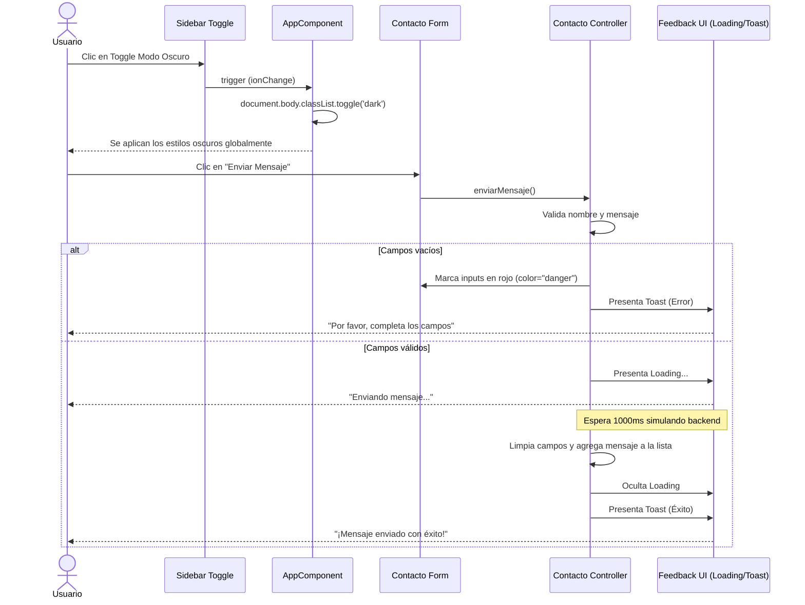

# Proceso de Integración de Interacciones

A continuación se detalla el flujo de trabajo implementado para añadir las mejoras visuales y funcionales en tu aplicación Ionic, abarcando las validaciones y animaciones del formulario, así como la habilitación global del Modo Oscuro.

## 1. Implementación del Modo Oscuro (Punto 4)
Para lograr un modo nocturno dinámico y sin recargas:
- Modificamos el **Sidebar (Menú Lateral)** en `app.component.html` añadiendo un componente `<ion-toggle>` acompañado de su ícono (`moon-outline`).
- Enlazamos este toggle a un método `toggleDarkMode()` en `app.component.ts`.
- Este método interviene directamente en el DOM inyectando dinámicamente la clase `.dark` a la etiqueta `<body>` (`document.body.classList.toggle('dark', ...)`) apoyándose en el sistema de variables de Ionic.

## 2. Implementación de Feedback en Contacto (Punto 3)
Mejoramos radicalmente la experiencia de usuario dentro de la pantalla de Contacto:
- **Estética Outline**: Actualizamos los elementos `<ion-input>` para que usen la propiedad `fill="outline"`. Esto brinda un borde completo y estilizado con animaciones al enfocar el campo.
- **Validación Visual**: Creamos propiedades de estado en el controlador (`nombreError` y `mensajeError`) para pintar dinámicamente el borde del input en color rojo (`danger`) cuando se presiona enviar y el campo se encuentra vacío.
- **Simulación y Notificación (Toasts/Loaders)**:
  - Inyectamos los servicios `LoadingController` y `ToastController`.
  - Al dar clic en "Enviar Mensaje", si todo es válido, desplegamos un `ion-loading` por 1 segundo simulando latencia de red.
  - Al concluir la carga exitosamente, notificamos al usuario con un `ion-toast` de color verde (`success`). Si hay errores, usamos el toast en rojo (`danger`).

---

## Diagrama del Flujo de Interacción

El siguiente diagrama detalla cómo fluyen los eventos de usuario para estas dos nuevas características:

